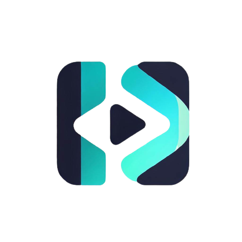

<a name="readme-top"></a>
<!--
*** Thanks for checking out the Best-README-Template. If you have a suggestion
*** that would make this better, please fork the repo and create a pull request
*** or simply open an issue with the tag "enhancement".
*** Don't forget to give the project a star!
*** Thanks again! Now go create something AMAZING! :D
-->


<!-- PROJECT SHIELDS -->
<!--
*** I'm using markdown "reference style" links for readability.
*** Reference links are enclosed in brackets [ ] instead of parentheses ( ).
*** See the bottom of this document for the declaration of the reference variables
*** for contributors-url, forks-url, etc. This is an optional, concise syntax you may use.
*** https://www.markdownguide.org/basic-syntax/#reference-style-links
-->

[![Contributors][contributors-shield]][contributors-url]
[![Forks][forks-shield]][forks-url]
[![Stargazers][stars-shield]][stars-url]
[![Issues][issues-shield]][issues-url]
[![MIT License][license-shield]][license-url]

<!-- PROJECT LOGO -->
<br />
<div align="center">
  <a href="https://github.com/RUBENgs2003/rgsPlayer">
    
  </a>

  <h3 align="center">rgsPlayer</h3>

  <p align="center">
    An awesome software to play m3u video format!
    <br />
    <a href="https://github.com/RUBENgs2003/rgsPlayer/blob/main/readme.md"><strong>Explore the docs »</strong></a>
    <br />
    <br />
    <a href="https://github.com/RUBENgs2003/rgsPlayer">View Demo (Comming soon...)</a>
    ·
    <a href="https://github.com/RUBENgs2003/rgsPlayer/issues">Report Bug</a>
    ·
    <a href="https://github.com/RUBENgs2003/rgsPlayer/issues">Request Feature</a>
  </p>
</div>


<!-- TABLE OF CONTENTS -->
<details>
  <summary>Table of Contents</summary>
  <ol>
    <li>
      <a href="#about-the-project">About The Project</a>
      <ul>
        <li><a href="#built-with">Built With</a></li>
      </ul>
    </li>
    <li>
      <a href="#getting-started">Getting Started</a>
      <ul>
        <li><a href="#prerequisites">Prerequisites</a></li>
        <li><a href="#installation">Installation</a></li>
      </ul>
    </li>
    <li><a href="#usage">Usage</a></li>
    <li><a href="#roadmap">Roadmap</a></li>
    <li><a href="#contributing">Contributing</a></li>
    <li><a href="#license">License</a></li>
    <li><a href="#contact">Contact</a></li>
    <li><a href="#acknowledgments">Acknowledgments</a></li>
  </ol>
</details>


<!-- ABOUT THE PROJECT -->
## About The Project

![Product Name Screen Shot][product-screenshot]

The project at hand is a multiplatform application called rgsPlayer, which aims to provide an intuitive way to play and display the contents of .m3u or .ts format files. To achieve this, the technology chosen is React Native, a JavaScript framework known for its high performance and ability to work on various devices and operating systems, including iOS, Android, and Linux.
<br><br>To ensure the proper use of the software and protect its intellectual property, the application will require a license key provided by specific developers or the project founder. This requirement will be outlined in the End User License Agreement (EULA).
<br><br>Currently, the software is still under development and only allows to be tested with XTREAM Codes API. The initial plan includes support for streaming television channels, movies, and series. Additionally, there is a possibility of adding features such as Electronic Program Guide (EPG) viewing and other enhancements.
If you are a developer interested in collaborating on this project, your help would be greatly appreciated. Please reach out to us to discuss further details.

<p align="right">(<a href="#readme-top">back to top</a>)</p>


### Built With

* React Native

<p align="right">(<a href="#readme-top">back to top</a>)</p>


<!-- GETTING STARTED -->
## Getting Started

To get a local copy up and running follow these simple example steps.

### Prerequisites

Install nodejs if you don't have it installed on your computer, to do so, download node from the node website (https://nodejs.org/) and install it. After that, perform the following steps.

* npm
  ```sh
  npm install npm@latest -g
  ```

### Installation

1. Clone the repo
   ```sh
   git clone https://github.com/RUBENgs2003/rgsPlayer.git
   ```
3. Install NPM packages (the console where you enter the command must be located in the path where you have the project)
   ```sh
   npm install
   ```
4. Create a file called ".env" and enter the following information:
   ```js
    YOUTUBE_API_KEY = "YOUR_YOUTUBE_API_KEY"
    XTREAM_USER = "YOUR_XTREAM_USER"
    XTREAM_PASSWD = "YOUR_XTREAM_PASSWD"
    XTREAM_DNS_SERVER = 'YOUR_XTREAM_DNS_SERVER'
   ```
5. Run the application
    ```sh
    npm start
    ```

<p align="right">(<a href="#readme-top">back to top</a>)</p>


<!-- USAGE EXAMPLES -->
## Usage

Comming soon...

<p align="right">(<a href="#readme-top">back to top</a>)</p>


<!-- ROADMAP -->
## Roadmap

- [x] Add Changelog
- [x] Add back to top links
- [x] Improved documentation

See the [open issues](https://github.com/RUBENgs2003/rgsPlayer/issues) for a full list of proposed features (and known issues).

<p align="right">(<a href="#readme-top">back to top</a>)</p>


<!-- CONTRIBUTING -->
## Contributing

Contributions are what make the open source community such an amazing place to learn, inspire, and create. Any contributions you make are **greatly appreciated**.

If you have a suggestion that would make this better, please fork the repo and create a pull request. You can also simply open an issue with the tag "enhancement".
Don't forget to give the project a star! Thanks again!

1. Fork the Project
2. Create your Feature Branch (`git checkout -b feature/AmazingFeature`)
3. Commit your Changes (`git commit -m 'Add some AmazingFeature'`)
4. Push to the Branch (`git push origin feature/AmazingFeature`)
5. Open a Pull Request

<p align="right">(<a href="#readme-top">back to top</a>)</p>


<!-- LICENSE -->
## License

Distributed under the MIT License. See `LICENSE.md` for more information.
To view End User License Agreement (EULA) information, see EULA.md

<p align="right">(<a href="#readme-top">back to top</a>)</p>


<!-- CONTACT -->
## Contact

Project Link: [https://github.com/RUBENgs2003/rgsPlayer](https://github.com/RUBENgs2003/rgsPlayer)

<p align="right">(<a href="#readme-top">back to top</a>)</p>


<!-- ACKNOWLEDGMENTS -->
## Acknowledgments

[React video player](https://github.com/react-native-video/react-native-video)

<!-- * [Choose an Open Source License](https://choosealicense.com)
* [GitHub Emoji Cheat Sheet](https://www.webpagefx.com/tools/emoji-cheat-sheet)
* [Malven's Flexbox Cheatsheet](https://flexbox.malven.co/)
* [Malven's Grid Cheatsheet](https://grid.malven.co/)
* [Img Shields](https://shields.io)
* [GitHub Pages](https://pages.github.com)
* [Font Awesome](https://fontawesome.com)
* [React Icons](https://react-icons.github.io/react-icons/search) -->

<p align="right">(<a href="#readme-top">back to top</a>)</p>


<!-- MARKDOWN LINKS & IMAGES -->
<!-- https://www.markdownguide.org/basic-syntax/#reference-style-links -->
[contributors-shield]: https://img.shields.io/github/contributors/RUBENgs2003/rgsPlayer.svg?style=for-the-badge
[contributors-url]: https://github.com/RUBENgs2003/rgsPlayer/graphs/contributors
[forks-shield]: https://img.shields.io/github/forks/RUBENgs2003/rgsPlayer.svg?style=for-the-badge
[forks-url]: https://github.com/RUBENgs2003/rgsPlayer/network/members
[stars-shield]: https://img.shields.io/github/stars/RUBENgs2003/rgsPlayer.svg?style=for-the-badge
[stars-url]: https://github.com/RUBENgs2003/rgsPlayer/stargazers
[issues-shield]: https://img.shields.io/github/issues/RUBENgs2003/rgsPlayer.svg?style=for-the-badge
[issues-url]: https://github.com/RUBENgs2003/rgsPlayer/issues
[license-shield]: https://img.shields.io/github/license/RUBENgs2003/rgsPlayer.svg?style=for-the-badge
[license-url]: https://github.com/RUBENgs2003/rgsPlayer/blob/main/LICENSE
[linkedin-shield]: https://img.shields.io/badge/-LinkedIn-black.svg?style=for-the-badge&logo=linkedin&colorB=555
[product-screenshot]: https://placehold.co/400?text=Comming+Soon&font=roboto
[React.js]: https://img.shields.io/badge/React-20232A?style=for-the-badge&logo=react&logoColor=61DAFB
[React-url]: https://reactjs.org/
